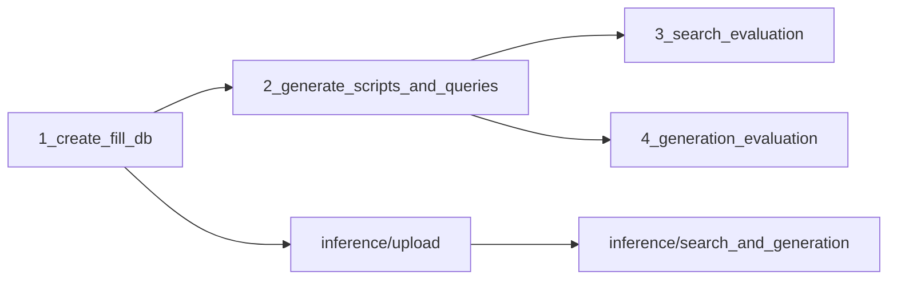

# vanna-sql

<a target="_blank" href="https://cookiecutter-data-science.drivendata.org/">
    
</a>

Vanna AI based search and generation of SQL scripts. The project builds a controlled evaluation pipeline for semantic search and text-to-SQL generation over SQLite databases with obfuscated schemas and Russian-language query descriptions.

## Workflow

Experiment notebooks run in order; inference notebooks demonstrate manual usage of the same stack.



1. **Build database** — render DDL, fill SQLite, create schema descriptions.
2. **Create eval corpus** — LLM-generated query descriptions, ground-truth SQL and results, style rewrites, related paraphrases.
3. **Evaluate search** — index examples in Qdrant, measure ranking metrics (MRR, MAP@k, Recall@k).
4. **Evaluate generation** — k-fold cross-validation, compare predicted result tables to ground truth.

## Setup

Copy [`env.example`](env.example) to `.env` and configure:

| Variable | Purpose |
|----------|---------|
| `QDRANT_URL`, `QDRANT_API_KEY` | Vector store connection |
| `OPENAI_API_KEY`, `OPENAI_API_URL` | OpenAI-compatible chat API (default: OpenRouter) |
| `OPENAI_MODEL`, `OPENAI_MODEL_MINI` | Primary and lightweight models for generation / rewriting |
| `DENSE_EMBEDDING_MODEL` | Sentence-transformer model name; weights are loaded from `models/` |
| `DEVICE` | `cpu` or `cuda` for embeddings |

Install dependencies from [`requirements.txt`](requirements.txt). Place the embedding model files under `models/{DENSE_EMBEDDING_MODEL}/`.

## Project layout

```
├── data/           Raw, external, interim, and processed datasets (see below)
├── models/         Local embedding model weights
├── notebooks/      Experiment and inference Jupyter notebooks
├── reports/        Evaluation methodology and algorithm documentation
├── src/            Python modules for data prep, Vanna integration, and metrics
├── requirements.txt
└── pyproject.toml
```

---

## Source code (`src/`)

### [`__init__.py`](src/__init__.py)

Marks `src` as a Python package.

### [`config.py`](src/config.py)

Central configuration loaded from environment variables via `python-dotenv`. Defines project paths (`RAW_DATA_DIR`, `INTERIM_DATA_DIR`, `PROCESSED_DATA_DIR`, `EXTERNAL_DATA_DIR`, `MODELS_DIR`, `REPORTS_DIR`) and settings for Qdrant, OpenAI-compatible APIs, embedding models, and compute device. Also exposes named model aliases used in evaluation notebooks (`OPENAI_MODEL_MINI`, `DEEPSEEK_MODEL`, etc.).

### [`dataset.py`](src/dataset.py)

Database and dataset preparation utilities.

- **Path helpers** — resolve raw, interim, processed, and external directories; build paths to SQLite DBs, schema descriptions, and query-description CSVs.
- **DDL rendering** — `render_ddl`, `render_table_ddls` inject Russian comments from JSON files into `schema_template.sql` using placeholder substitution; supports `inline` and `yaml` comment styles and `short` / `business` / `technical` variants.
- **Database build** — `create_database`, `load_csv_data`, `build_database` create and populate SQLite databases from raw CSVs.
- **Schema descriptions** — `build_schema_description_with_samples` produces human-readable schema text with sample rows for LLM prompts.
- **Query rewriting** — `rewrite_query_descriptions_csv` rewrites descriptions into multiple styles using schema-driven prompts; `load_style_schema_texts` loads per-style schema texts for batch operations.

### [`prompts.py`](src/prompts.py)

Prompt builders for all LLM-driven data generation steps. All user-facing text is in Russian.

- `build_query_description_prompt` — generate analytic task descriptions by difficulty (easy / medium / hard).
- `build_sql_generation_prompt` — generate read-only SQLite SQL from a description.
- `build_query_description_rewrite_prompt` — rewrite a description into short, business, or technical style.
- `build_related_query_description_prompt` — paraphrase a description for search robustness testing.

Style guidance is driven by the schema description content rather than generic formatting rules.

### [`script_generator.py`](src/script_generator.py)

LLM pipeline for creating the evaluation corpus.

- `generate_query_descriptions` — create a CSV of query descriptions with uuid and difficulty labels.
- `generate_sql_scripts_and_results` — for each description, generate SQL, validate read-only, execute on SQLite, normalize and save script + result CSV.
- `generate_related_query_descriptions_csv` — expand the rewritten CSV with related paraphrases per style and variant index.
- `extract_sql` — parse SQL from LLM responses (SELECT, WITH, or fenced code blocks).

### [`llm_client.py`](src/llm_client.py)

Shared OpenAI-compatible chat client wrapper.

- `call_openai_chat_with_retries` — chat completion with configurable timeout, retries, and backoff.
- `extract_response_text` — normalize response content from different API response shapes.

Used by `script_generator.py` and `dataset.py` for all LLM calls.

### [`vanna_connector.py`](src/vanna_connector.py)

Custom Vanna integration combining Qdrant vector storage, sentence-transformer embeddings, and OpenAI-compatible chat.

- `QdrantVectorStore` — embeds SQL examples by question text only (not SQL syntax).
- `VannaClient` — extends Vanna with read-only guard on intermediate SQL execution during `generate_sql`.
- `initialize_vanna` — factory that wires Qdrant, SQLite (or other DB), and chat model from config dicts.

### [`search_metrics.py`](src/search_metrics.py)

Search quality evaluation.

- `run_search_evaluation_pipeline` — per description style: reset Qdrant, ingest DDLs and question–SQL pairs, run search for related query columns, save ranked predictions.
- `compute_ranking_metrics` — MRR, MAP@k, Recall@k per predicted column and pooled combined scores; supports multiple k values in one CSV.
- `combine_search_ranking_metrics` — merge per-style metrics into a wide Excel file (`combined` or `respective` column mode).
- Low-level metric functions: `reciprocal_rank`, `average_precision_at_k`, `recall_at_k`.

### [`generation_metrics.py`](src/generation_metrics.py)

SQL generation quality evaluation.

- `run_generation_evaluation_pipeline` — stratified k-fold CV over model × DDL comment style × description style combinations; trains on fold, generates SQL for test queries, saves predictions.
- `compute_generation_metrics` — compare predicted result CSVs to ground truth; assign labels (full match, row/column/value mismatch, not generated).
- `combine_generation_metrics` — aggregate label counts across combos into Excel, grouped by difficulty.

### [`plots.py`](src/plots.py)

Visualization for combined evaluation results.

- `plot_combined_search_ranking_metrics` — bar charts of MRR / MAP@k / Recall@k across description styles.
- `plot_combined_generation_metrics` — grouped bar charts of generation labels per difficulty, model, and style combination.

---

## Notebooks (`notebooks/`)

### Experiments ([`notebooks/experiments/`](notebooks/experiments/))

Run in numbered order for the full evaluation pipeline.

| Notebook | Purpose |
|----------|---------|
| [`1_create_fill_db.ipynb`](notebooks/experiments/1_create_fill_db.ipynb) | Render table DDLs with Russian comments, create and fill the SQLite database, build a schema description with sample rows, preview tables. Exports an example DDL CSV for inference. |
| [`2_generate_scripts_and_queries.ipynb`](notebooks/experiments/2_generate_scripts_and_queries.ipynb) | Generate query descriptions by difficulty, produce ground-truth SQL scripts and result tables, rewrite descriptions into short / business / technical styles, generate related paraphrases. Includes a helper to re-run existing `.sql` scripts and save results. |
| [`3_search_evaluation.ipynb`](notebooks/experiments/3_search_evaluation.ipynb) | Run the search evaluation pipeline, compute ranking metrics at multiple k values, combine metrics across styles (combined and respective modes), plot bar charts. |
| [`4_generation_evaluation.ipynb`](notebooks/experiments/4_generation_evaluation.ipynb) | Run generation evaluation across multiple LLMs and style combinations via stratified k-fold CV, compute per-combo label metrics, combine and plot results for rewritten and original query columns. |

### Inference ([`notebooks/inference/`](notebooks/inference/))

Interactive demos using the same Vanna client as experiments.

| Notebook | Purpose |
|----------|---------|
| [`1_upload_data_to_vector_store.ipynb`](notebooks/inference/1_upload_data_to_vector_store.ipynb) | Initialize Vanna, upload rendered DDLs and question–SQL pairs from CSV into Qdrant. |
| [`2_search_and_generation.ipynb`](notebooks/inference/2_search_and_generation.ipynb) | Demo `get_similar_question_sql` for semantic search and `generate_sql` for text-to-SQL on a user query. |

---

## Data (`data/`)

Two databases are supported: `sakila` and `bank_transaction_monitoring`. Each follows the same layout under its database name.

### `data/raw/{database}/`

Immutable source inputs. Not modified by pipelines.

| Content | Description |
|---------|-------------|
| `*.csv` | Raw table data with obfuscated column names (e.g. `c01`, `a02`) |
| `schema_template.sql` | DDL template with `{{placeholders}}` for table/column names and comment blocks |
| `schema_mapping.json` | Maps logical names to obfuscated names; defines CSV-to-table load order |

### `data/external/{database}/`

Hand-authored or third-party comment files injected into DDL during rendering.

| File | Description |
|------|-------------|
| `comments_short.json` | Brief Russian field comments |
| `comments_business.json` | Business-oriented comments |
| `comments_technical.json` | Technical comments with more schema detail |

### `data/interim/{database}/`

Generated working artifacts produced by notebooks and pipelines.

```
data/interim/{database}/
├── schema_descriptions/
│   └── schema_description_{inline|yaml}_{short|business|technical}.txt
├── query_descriptions/
│   ├── query_descriptions_{style}_{variant}.csv              # base descriptions
│   ├── query_descriptions_{style}_{variant}_rewritten.csv    # three style columns
│   └── query_descriptions_{style}_{variant}_rewritten_related.csv  # paraphrases
├── scripts/
│   └── {uuid}.sql                          # ground-truth SQL
├── results/
│   └── {uuid}.csv                          # ground-truth query results
├── search/
│   ├── {style}_top_{k}.csv                 # ranked Qdrant id predictions
│   └── ranking_metrics_{style}.csv         # MRR, MAP@k, Recall@k per column
├── generation/
│   ├── prediction_scripts/{combo}/         # generated SQL per eval combo
│   ├── prediction_results/{combo}/         # executed result tables
│   └── metrics/{combo}.csv                 # per-uuid quality labels
└── table_ddls_{style}_{variant}.csv        # optional DDL export (notebook 1)
```

- **combo** naming: `{comment_style}_{description_style}_{model_key}` (e.g. `yaml_short_gpt-5-4-nano`).
- **search** CSVs include `true_qdrant_uuid` and `predicted_{short|business|technical}` columns with semicolon-separated ranked ids.

### `data/processed/{database}/`

Canonical outputs used for analysis and reporting.

| Content | Description |
|---------|-------------|
| `{database}_{inline\|yaml}_{short\|business\|technical}.sqlite.db` | Filled SQLite databases — six variants per database (2 comment styles × 3 description variants) |
| `metrics/combined_search_top_{k}_{combined\|respective}.xlsx` | Wide summary of search metrics across description styles |
| `metrics/combined_generation_{rewritten\|query}.xlsx` | Aggregated generation label counts by difficulty and combo |
| `plots/*.png` | Bar charts produced by evaluation notebooks |

---

## Reports (`reports/`)

Methodology and design documentation (not generated at runtime):

| Document | Description |
|----------|-------------|
| [`search_and_generation_algorithm.md`](reports/search_and_generation_algorithm.md) | High-level system design: vector store contents, search and generation flow |
| [`search_quality_evaluation.md`](reports/search_quality_evaluation.md) | How search ranking metrics are computed |
| [`generation_quality_evaluation.md`](reports/generation_quality_evaluation.md) | How generation result-matching labels are computed |
| [`test_data_preparation_ru.md`](reports/test_data_preparation_ru.md) | How the evaluation corpus is created (Russian) |
| [`search_quality_evaluation_ru.md`](reports/search_quality_evaluation_ru.md) | Search evaluation overview (Russian) |
| [`generation_quality_evaluation_ru.md`](reports/generation_quality_evaluation_ru.md) | Generation evaluation overview (Russian) |
